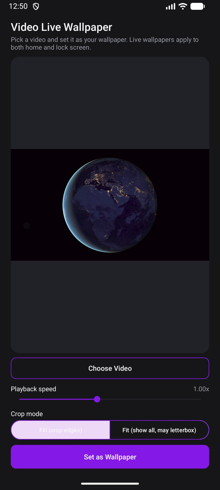
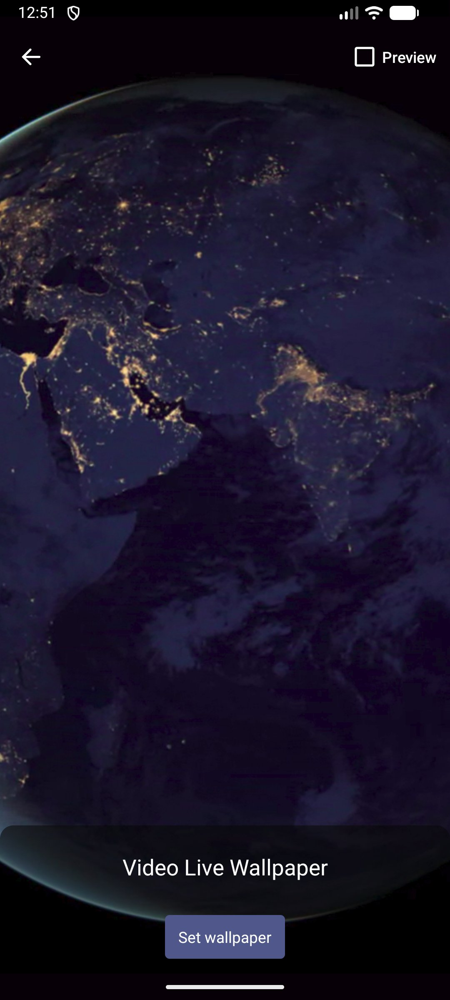

# Video Live Wallpaper

A small Android app that lets you pick any video or animated GIF from your device and set it as a looping live wallpaper.

<p align="center">
  
  
</p>

## Features

- Pick a video or animated GIF with the system file picker
- Preview it looping (muted) before setting it
- Adjustable playback speed (0.25x–2.0x)
- Fill (crop to cover the screen) or Fit (show the whole frame, letterboxed if needed) scaling, shown in both the preview and the wallpaper
- Portrait phone videos display the right way up
- One-tap wallpaper setting through Android's own live wallpaper picker
- No ads, no analytics, no network access of any kind

## Install

- **F-Droid:** [Video Live Wallpaper on F-Droid](https://f-droid.org/packages/io.github.codeg0blin.videowallpaper/)
- **GitHub:** download the APK from the [Releases](https://github.com/codeg0blin/video-live-wallpaper/releases) page.

Requires Android 8.0 (API 26) or newer.

## How it works

The app implements an Android `WallpaperService` that loops your chosen video using `MediaPlayer`. Since version 1.2.0, decoded frames go to a `SurfaceTexture` and are drawn with a small OpenGL ES 2.0 renderer (`VideoFrameRenderer.kt`), which applies the video's own rotation so portrait phone clips come out upright. This is what makes Fill and Fit scaling work: Android's usual video scaling relies on resizing the display surface, which live wallpapers aren't allowed to do (see issue #1).

GIFs (version 1.3.0) don't go through `MediaPlayer`. `GifDecoder.kt` is a small pure-Kotlin GIF89a decoder written for this app, and `GifPlayer.kt` shows one frame at a time, timed by each frame's own delay divided by your speed setting. Frames are uploaded as textures to the same renderer, so Fill and Fit work identically for GIFs and videos. The app recognises GIFs by their file header rather than their file name. Transparent areas of a GIF are drawn black, and GIF files over 50 MB are not supported.

Setting the wallpaper goes through Android's own system picker (`ACTION_CHANGE_LIVE_WALLPAPER`). The OS requires this for all live wallpaper apps, not just this one.

Android applies a live wallpaper to the home screen and lock screen together, and the live wallpaper API has no per-screen setting. Some devices' system pickers may still offer extra choices; if yours does, the video plays on whichever screens you select.

## Privacy

The app has no internet permission and contains no analytics, tracking or advertising code. The only thing it stores is a reference (URI) to the video or GIF you picked, kept locally in `SharedPreferences` on your device.

## Building

Open the project in Android Studio, or build from the command line:

```
./gradlew assembleDebug
./gradlew assembleRelease
```

Unit tests for the GIF decoder run with `./gradlew test`.

Requires JDK 17 and Android SDK 34 (`compileSdk`/`targetSdk` 34, `minSdk` 26).

## Changelog

Per-version release notes are in [`fastlane/metadata/android/en-US/changelogs`](fastlane/metadata/android/en-US/changelogs), named by version code.

## Contributing

Bug reports and suggestions are welcome via [issues](https://github.com/codeg0blin/video-live-wallpaper/issues).

## License

Apache License 2.0. See [LICENSE](LICENSE) and [NOTICE](NOTICE).

See [ATTRIBUTION.md](ATTRIBUTION.md) for a full list of the open-source libraries this app depends on, and a note on how the source code itself was written.
